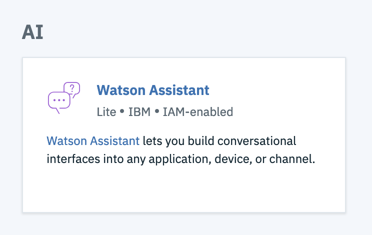
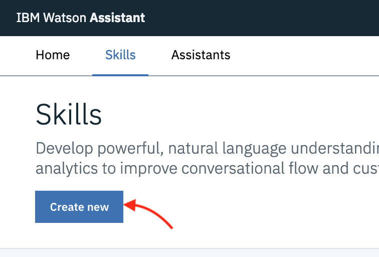
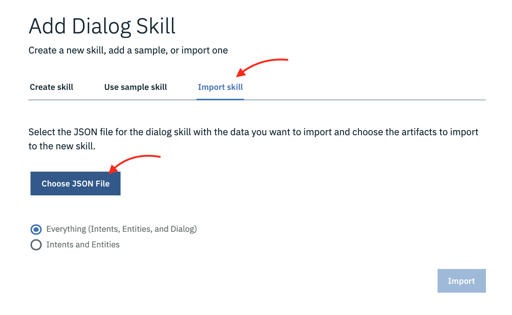

# Conversation Street
NodeJS Dublin Meetup code sample.

For the Assistant to work you will need to import the skill into your assistant. You can create a new skill using the `skill-Reverse-order-a-pizza.json` file in the main project folder to just get it running.

I would advise you to read the documentation and/or go through the presentation slides and then recreate the Skill yourself so that you understand the various pieces of the puzzle before building something new. A lot can be achieved using standard components, so you don't need to reinvent the wheel.

You'll need to set up an account on https://cloud.ibm.com and create a _Service_ called **Watson Assistant** from the **AI** section of the **Catalog**.

## Choose Watson Assistant service in the IBM Cloud Catalog



To _import_ the existing skill follow the steps below.

## Create a new Skill



## Go to import skill tab and choose the `skill-Reverse-order-a-pizza.json` JSON file in the main project folder



Start off by putting your environment variables in a .env file:

```
$ cp .env.sample .env
```

After providing config start the app as usual:

```
$ npm start
```
